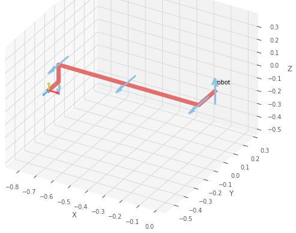
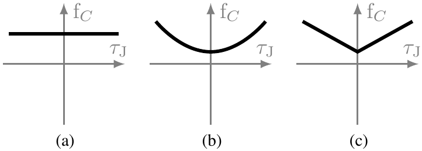

# Aarhus University Robotics Toolbox (AURT) Overview

# Installation

To install the tool, type:
```
pip install aurt
```
or, if plotting and visualization features are needed,
```
pip install aurt[vis]
```

# Command Line Interface

The following shows the different use cases that aurt supports.
In order to improve performance, the model is compiled in different stages, 
in a way that allows the user to try alternative joint dynamics models without having to re-create the full model, 
which is a computationally demanding procedure.

## Compile Rigid Body Dynamics Model

```
aurt compile-rbd --mdh mdh.csv --out rigid_body_dynamics
```
Reads the Modified Denavit-Hartenberg (MDH) parameters in file `mdh.csv` and outputs rigid-body dynamics model to file `rigid_body_dynamics`.
The generated model does not include the joint dynamics.
To visualize the kinematics of the robot, make sure the `roboticstoolbox-python` is installed, and add the argument `--plot` to the `compile-rbd` command.
<p align="center">
  
</p>

## Compile Robot Dynamics Model

```
aurt compile-rd --model-rbd rigid_body_dynamics --friction-torque-model square --friction-viscous-powers 2 1 4 --out robot_dynamics
```

Reads the rigid-body dynamics model created with the `compile-rbd` command, and generates the robot dynamics model, 
taking into account the joint dynamics configuration.

The friction configuration options are:
- `--friction-torque-model TYPE` where `TYPE in {none, square, absolute}` are depicted in the figure below for, respectively, parts (a), (b), and (c).
<p align="center">
  
</p>

- `--friction-viscous-powers POWERS` where `POWERS` is a set  of integers having the format `P1 P2 ...` used to define the odd polynomial function
 in the angular velocity
 of any joint as

  

  with  the viscous coefficient of friction corresponding to the integer element 
   of
  , 
   if 
   is even
  and  otherwise.

## Calibrate

```
aurt calibrate --model robot_dynamics --data measured_data.csv --gravity 0 0 -9.81 --out-params calibrated_parameters.csv --out-calibrated-model rd_calibrated --plot
```

Reads; 1) the model produced by the `compile-rd` command, 2) the measured data in `measured_data.csv`, and 3) the gravity components `GX GY GZ` and writes; 1) the values of the calibrated base parameters to `calibrated_parameters.csv` and 2) the calibrated robot dynamics model to `rd_calibrated`.
The gravity vector determines the orientation of the robot base for which the parameters will be calibrated.
For showing the calibration plot, use the argument `--plot`.

The measured data should contain the following fields:
- `timestamp` of type float, representing the number of seconds passed from a given reference point.
- `target_qd_j` of type float, representing the `j`th joint target angular velocity, as computed by the robot controller, where `j` is an integer in `{0, 1, ..., N}`.
- `actual_q_j` of type float, representing the `j`th joint angle, as measured by the robot controller, where `j` is an integer in `{0, 1, ..., N}`.
- `actual_current_j` of type float, representing the `j`th joint current, as measured by the robot controller, where `j` is an integer in `{0, 1, ..., N}`.

## Predict

```
aurt predict --model rd_calibrated --data measured_data.csv --gravity 0 0 -9.81 --out predicted_output.csv
```

Reads; 1) the model produced by the `calibrate` command, 
2) the measured data in `measured_data.csv`, and
3) the gravity components `GX GY GZ`,
and writes the predicted output to `predicted_output.csv`.

The prediction fields are:
- `timestamp` of type float, referring to the time of the measured data, as in [Calibrate](#predict).
- `predicted_current_j` of type float, representing the `j`th joint current, as predicted by the robot model, where `j` is an integer in `{0, 1, ..., N}`.

## Calibrate and Validate
```
aurt calibrate-validate --model robot_dynamics --data measured_data.csv --gravity 0 0 -9.81 --calibration-data-rel FRACTION --out-params calibrated_parameters.csv --out-calibrated-model rd_calibrated --out-prediction predicted_output.csv --plot
```
Simultaneously calibrates and validates the robot dynamics model using the dataset `measured_data.csv`. 
The command implements the functionalities of the commands `calibrate` and `predict`. 
The data of `measured_data.csv` is separated into two consecutive parts 1) calibration data and 2) validation data. 
The calibration data has a duration of 0.1 < `FRACTION` < 0.9 times the duration of `measured_data.csv` while the remaining part of the data is used for validation.

# Contributing

## Development environment

To setup the development environment:
1. Open terminal in the current folder.
2. Install all packages for development: `pip install -e .[vis]`.
3. Unpack the datasets (see [Dataset management](#dataset-management))
4. To run all non live tests, open a command prompt or powershell in the repository root, and run `python build.py --run-tests all-non-live`. 
   If you are using Linux, use `python3` instead of `python`.

_NOTE: Run tests before commits. If they don't pass, fix them before committing._

## Publishing this package on pypi

1. Update version in `setup.py`
2. Make sure all tests, except the live ones, are passing.
3. Delete folders `dist` `build` if they exist.
4. Activate virtual environment.
5. Install twine and wheel: `pip install twine wheel`
6. Create a source distribution: `python setup.py sdist`
7. Create the binary distribution: `python setup.py bdist_wheel`
8. Upload distribution to PyPI: `python -m twine upload dist/*`
9. When asked for username and password, use the token and password created with your PyPI account.

## Dataset management

### Small dataset (< 100MB compressed)

If the data is small, then:
- Each round of experiments should be placed in a folder with an informative name, inside the Dataset folder.
- There should be a readme file in there explaining the steps to reproduce the experiment, parameters, etc...
- The csv files should be 7ziped and committed. Do not commit the csv file.
- There should be tests that use the data there.

### Large Datasets (>= 100MB compressed)

If the data is large, then:

- A "lite" version of the dataset should be in the dataset folder (following the same guidelines as before)
  - This is important to run the tests.
- the larger version should be placed in the shared drive (see below).

There is a shared drive for large datasets.
The shared drive **Nat_robot-datasets** has been created with **Emil Madsen** as owner.

| **Shared Drive**   | **Owner**              | **E-mail**                            | **Department**                            |
| ------------------ | ---------------------- | ------------------------------------- | ----------------------------------------- |
| Nat_robot-datasets | au504769 (Emil Madsen) | [ema@ece.au.dk](mailto:ema@ece.au.dk) | Electrical and Computer Engineering (ECE) |


 **Read/write access is assigned to:** 

| **Username** | **Name**                       | **E-mail**                                                | **Department**                            |
| ------------ | ------------------------------ | --------------------------------------------------------- | ----------------------------------------- |
| au602135     | Cláudio Ângelo Gonçalves Gomes | [claudio.gomes@ece.au.dk](mailto:claudio.gomes@ece.au.dk) | Electrical and Computer Engineering (ECE) |
| au522101     | Christian Møldrup Legaard      | [cml@ece.au.dk](mailto:cml@ece.au.dk)                     | Electrical and Computer Engineering (ECE) |
| au513437     | Daniella Tola                  | [dt@ece.au.dk](mailto:dt@ece.au.dk)                       | Electrical and Computer Engineering (ECE) |

For more information on access, self-service and management of files: https://medarbejdere.au.dk/en/administration/it/guides/datastorage/data-storage/
